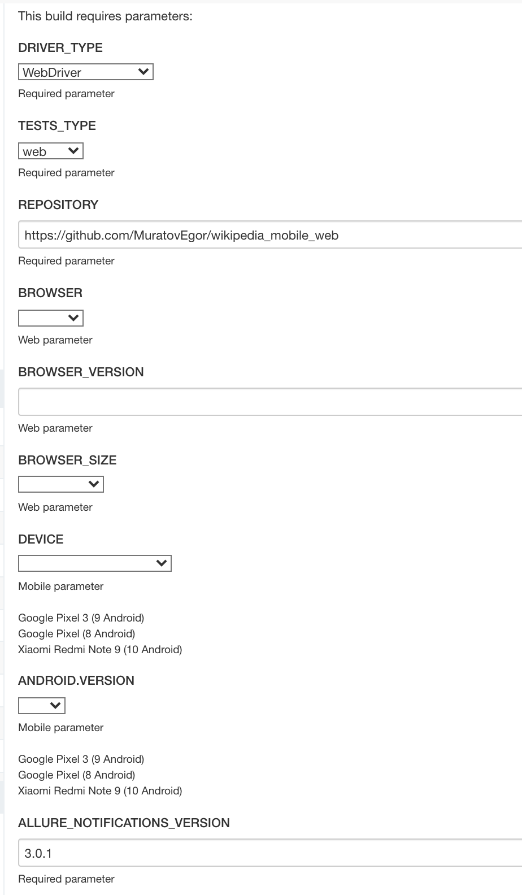

# Autotests for https://wikipedia.org/ Mobile + Web
___
## Technologies used:
| GitHub | IntelliJ IDEA | Java | Gradle | Browserstack | Selenide |
|:------:|:----:|:----:|:------:|:------:|:--------:|
|  |  |  |  |  |  |

| Jenkins | Selenoid | Allure Report | Allure TestOps | Telegram |
|:--------:|:-------------:|:---------:|:-------:|:--------:|
|  |  |  |  |  |
___


## Default settings used [for Jenkins startup](https://jenkins.autotests.cloud/job/c06_egormuratov_wikipedia_mobile_web/) <a href="https://www.jenkins.io/"></a>

* DRIVER_TYPE (Required parameter. SelenoidDriver (for WEB), BrowserStackDriver (for mobile), AppiumDriver (in develop))
* TESTS_TYPE (Required parameter. web or android)
* REPOSITORY (Required parameter)
* BROWSER (Web parameter)
* BROWSER_VERSION (Web parameter)
* BROWSER_SIZE (Web parameter)
* DEVICE (Mobile parameter)
* ANDROID.VERSION (Mobile parameter)
* ALLURE_NOTIFICATIONS_VERSION (Required parameter. default 3.0.2)



### Run tests with filled local.properties:

```bash
gradle clean android 
```

or

```bash
gradle clean web 
```

### Run tests with not filled local.properties:

```bash
gradle clean android -Ddriver=BrowserStackDriver -Dandroid.version=9.0 -Ddevice="Google Pixel 3"
```

or

```bash
gradle clean web -Dbrowser=chrome -DbrowserVersion=91.0 -DbrowserSize=1920x1080
```

### Serve allure report:

```bash
allure serve build/allure-results
```

## List of tests in Allure TestOps


## Notification of test results via a bot on Telegram <a href="https://telegram.org/"> </a>


## Analysis of results in Jenkins via Allure Reports<a href="https://qameta.io/"></a>

## Analysis of results in Allure TestOps <a href="https://qameta.io/"></a>


## Video of the test run, taken from the Selenoid runtime environment <a href="https://aerokube.com/selenoid/"></a>


